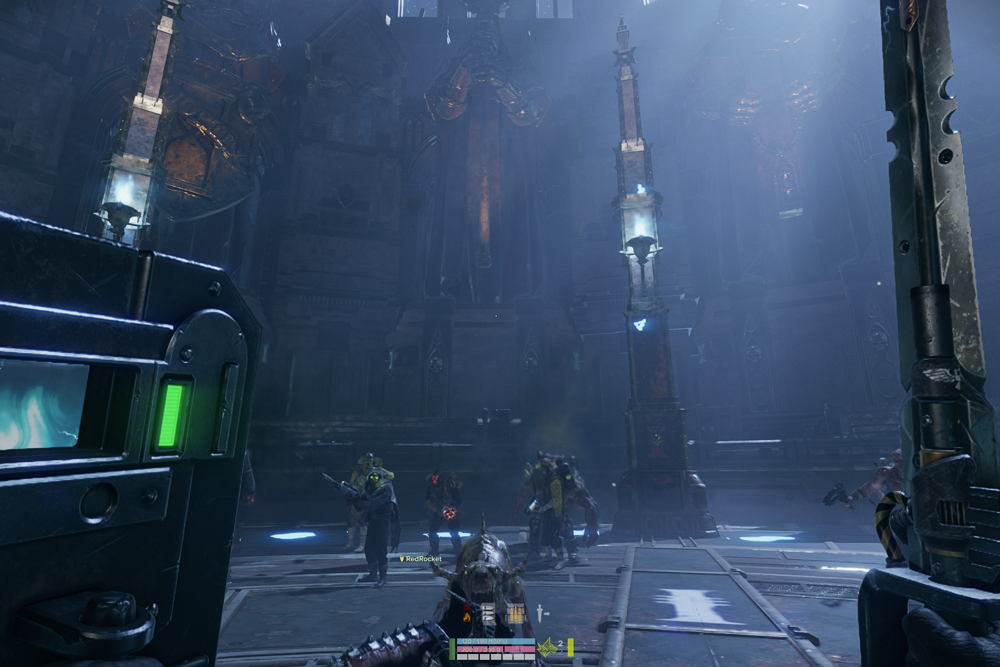
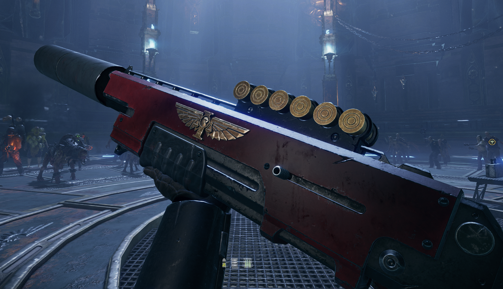
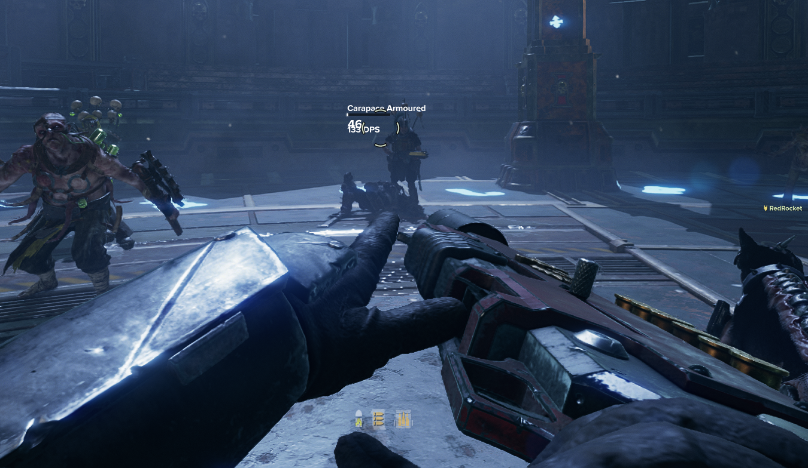
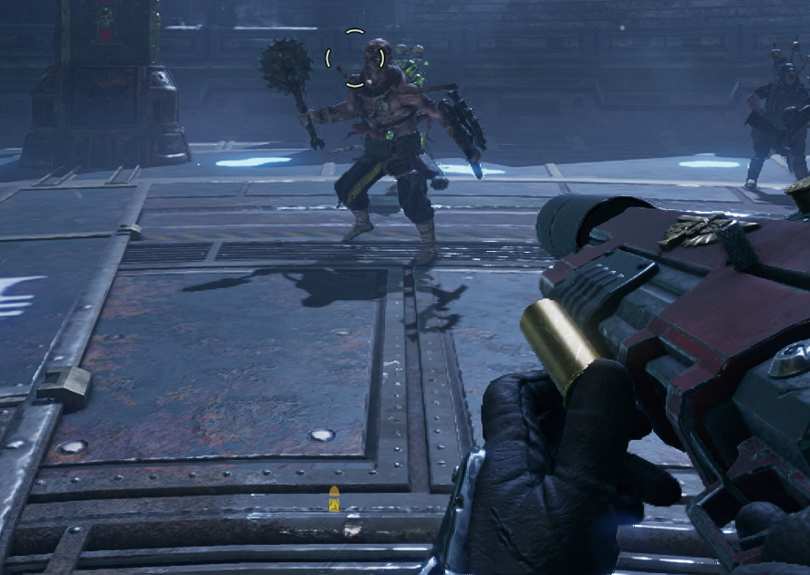

Add-on for [HUD Studio](https://www.nexusmods.com/warhammer40kdarktide/mods/1263).

# Description
Library of HUD Studio blocks with basic information hidden until needed (or demanded). Typically bars with numbers and color-coded icons.

## Blocks
By default, all blocks will also appear on demand when you hold the hotkey `T`.

### Player Panel
- Toughness and Toughness text
    - Appears when changed then fades
    - Appears at < 30%
- Health and Health text
    - Appears when changed then fades
    - Appears at < 30%
- Stamina
    - Appears at < 30%
- Ability charge progress
    - Appears when you have no ability ready and the charge is at > 80% progress
- Peril
    - Bar that fades in with intensity
    - It goes from faded out pink to hot pink
    - Not in the pictures because it's fully transparent at 0%, but it's below the stamina bar

### Ammo
These appear on hotkey and inspecting the relevant weapon. All of these show value by color-coding.
- Magazine icons
    - Changes color at 50% capacity and 100%
    - Also appears when holding reload while the ranged weapon is out
- Total ammo icons
    - Same as above
    - When at >= 85% ammo, the icon turns green to represent not needing to pick up a small ammo (does not change based on Havoc so you'll have to figure that one out yourself)
- Special Ammo
    - Same as above
    - Also appears when holding the load special ammo button while the ranged weapon is out
- Melee Special
    - No additional conditions

There are disabled options to show the raw numbers.

### Blitz Box (Below Max)
- Blitz Icon
    - Only on demand. I know what blitz I have equipped.
- Blitz count / max
    - Appears when blitz is in hand and not at max charges
- Blitz recharge bar
    - Appears when charge > 80% and not at max charges
    - There's a numerical version I have disabled by default
    - Note that neither of them work with talent regeneration, where they'll get stuck at 100%
        - Namely this affects Demolition Stockpile, which is not good for me as a Veteran player
        - Disable this if it's annoying. I'm leaving this here for when there's a workaround found.

### Near Crosshair
Low opacity numbers for a quick glance while fighting.
- Dodge count / max
    - Only appears when at <= 1
    - Turns red as you go more negative
- Dodge refresh bar
    - Only appears when at <= 1
    - I keep this off by default because I don't care
- Peril numerical value
    - Appears at >95%
    - Decimal point accuracy so you know if it's safe to use Brain Burst
    - :3
- Weapon heat
    - Appears when the respective weapon is held
    - I put these in the same place for melee and ranged
    - One is orange and one is blue. I forgot which is which but you can also just look at the thing in your hand

# Installation
I assume you know how to install mods. If not, here's the [guide for manual installation](https://dmf-docs.darkti.de/#/installing-mods).
1. Install [HUD Studio](https://www.nexusmods.com/warhammer40kdarktide/mods/1263)
2. Install this mod (anywhere in the load order)
3. Open the game and load a character
4. Open the HUD Studio menu (set keybind in Mod Options)
5. Import blocks from this mod's library

Move and edit them to your heart's desire!