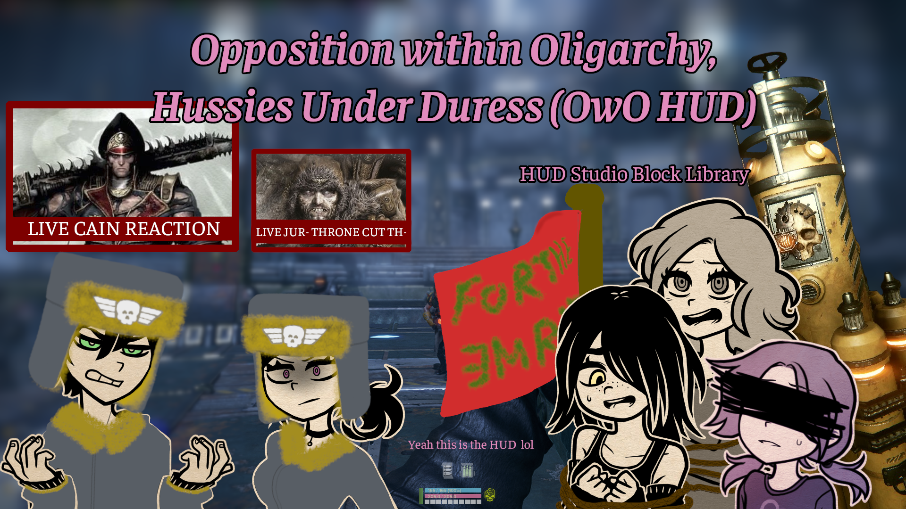

Add-on for [HUD Studio](https://www.nexusmods.com/warhammer40kdarktide/mods/1263).

# Description
Library of HUD Studio blocks with basic information hidden until needed (or demanded). Typically bars with numbers and color-coded icons.

Just installing this won't change anything; this is just a resource for you to use with HUD Studio.

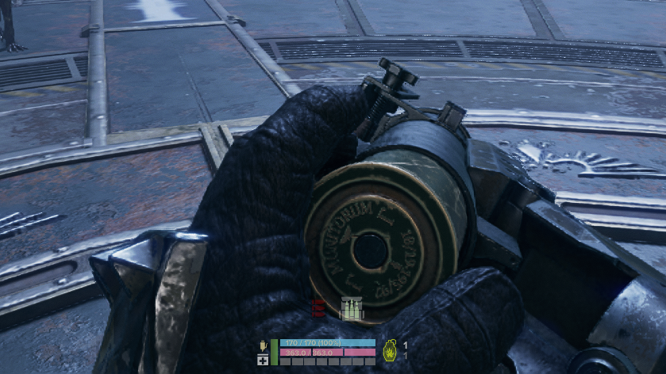

Now I will yap about design. Skip to the next headings if you want.

I am a big fan of contextual HUDs with minimal intrusion, and I generally will prioritize immersion over small gameplay benefits. However, there's a tricky balance between having the information you need and having too many things on the screen too often, and this balance can shift depending on experience and rustiness (e.g. Knowing roughly how much stamina drains, but being less precise with this after a long break). Anyways, that balance can be tipped by a lot of information that's good to know, but not all the time. One thing that annoyed me in Space Marine 2 was having the health bar on the screen. If it was always off, knowing when to stimm harder to nail down, but if it was always on, it's annoyingly sitting there, taunting me! The contextual display helped, but that specific case would show it any time you were in combat, even if at full health, and I *really* dislike how large it is.

So if I'm not satisfied with Space Marine 2's HUD, what do I like? Tactical shooters. Well, not strictly tactical, but generally shooters leaning towards grounded realism. Simple colors. Contrast to be noticeable when needed. Hiding elements when they're not important, but reappearing in context. A hotkey to show additional information. That's the vibe I like, especially the hotkey. 

Let's look at healthbars. I only need to know my health when I'm taking damage or if I'm dangerously low, and even that last part is debatable since I'd know with the first part. But only appearing on context isn't great either. What if I fought for like 10 minutes before this downtime, and I have a heal. Do I use it now? I remember being low, but was I healed without noticing? What if I just misremembered? Use the hotkey to show more and boom, problem solved. It's also as if your character is taking this time to check up on all their equipment, represented by the HUD appearing.

And shoutout to Ring HUD. Great mod. I'd still be using it if I liked... rings...

# Installation
I assume you know how to install mods. If not, here's the [guide for manual installation](https://dmf-docs.darkti.de/#/installing-mods).
1. Install [HUD Studio](https://www.nexusmods.com/warhammer40kdarktide/mods/1263)
2. Install this mod (anywhere in the load order)
3. Open the game and load a character
4. Open the HUD Studio menu (set keybind in Mod Options)
5. Import blocks from this mod's library

Move and edit them to your heart's desire!

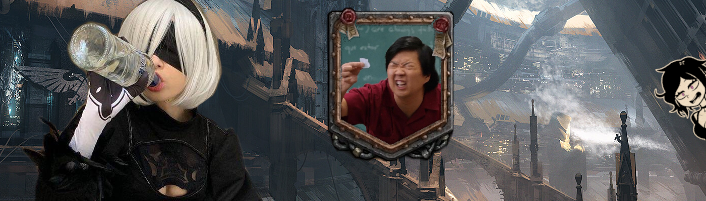

# Blocks
By default, all blocks will also appear on demand when you hold the hotkey `T`.

Elements marked [ODO] only appear when using the hotkey.

### Player Panel

- Toughness and Toughness text
    - Appears at < 30%
    - Toughness bar is blue, and it turns yellow when over 100% (with a more faded yellow from 100%-110%)
    - When toughness is broken, the bar background turns deep red
- Health, Health text, and Corruption
    - Appears when changed, then fades
    - Appears at < 30% Health
- Stamina
    - Appears at < 30%
- Ability charge progress
    - Appears when you have no ability ready and the charge is at > 80% progress
    - The vertical green bar
- Peril
    - Bar that fades in with intensity (below Stamina)
    - It goes from faded out pink to hot pink
    - Not in the pictures because it's fully transparent at 0%, but it's below the stamina bar
- Stimm
    - Appears if it's a med stimm and someone on the team is at 1 wound
    - Color-coded based currently held stimm
        - Uses colors from RecolorStimms if you have that installed
        - To use vanilla colors, duplicate the block --> go to this node --> Rectangle Style --> Color --> Change "Code" to "Data Source"
    - Hive Scumm have to check OD. The audio cue is enough for me.
- Pocketable
    - Appears when team is low on the appropriate resource
    - Medical Crate: Show if team health is low 
        - Low means missing 500 hitpoints, because that's the capacity of a Medical Crate
        - This does not account for clearing corruption when a Veteran is alive with Field Improvisation
    - Ammo Cache: Show if team ammo is low.
        - If >= 3 team members have < 50% ammo.
        - If >= 2 team members have < 20% ammo.
        - I hard-coded these thresholds based on the normal conditions of Ammo crates having 4 uses of 100% reserve restore. 
        - Havoc players can suffer because isn't that what you want???
        - lol just kidding, you can open the code and edit those thresholds if you'd rather have it earlier/later.

### Player Panel Icons and Progress
Alternative version of player panel with no text, focusing on cooldown availability. These can appear on demand, but note that some of them will still be hidden when the value is high enough (such as Stamina >= 50% still being hidden).

From left to right, top to bottom:
- Ability
    - Appears when >= 80% readiness
    - Starts at faded yellow (like a dark mustard), then becomes full yellow when a charge is ready
- Stamina
    - Fades in and becomes darker as you use it
    - Starts out not visible
    - < 50% is faded brown-orange
    - < 25% is brown-orange
    - < 15% is red
    - 0% is black
- Health
    - Appears when changed or < 30%
    - [75%, 100%] is bright green
    - [50%, 74%] is more yellow-green
    - [25%, 49%] is yellow
    - [15%, 24%] is orange-yellow
    - [0%, 14%] is red
    - Wounds are not shown and you are expected to just know that based on percentage
- Hives Cum Stimm
    - Overlayed with Health
    - Appears when >= 80% readiness
    - Starts at faded pink, then becomes full pink when ready
- Armor
    - Appears when < 30%
    - Overtoughness is yellow
    - [50%, 100%] is blue
    - [25%, 49%] is darker blue
    - [5%, 24%] is even darker blue
    - Below that is basically black
- Ability Progress Bar
    - Below the row of icons
    - Appears when ability is active
- Peril Progress Bar
    - Below ability progress
    - Same rules as previous panel (it's copied over)
- Hives Cum Stimm Progress Bar
    - In the same place as peril
    - Appears when Stimm is active and player is Hives Cum
    - I have it like that since it'd activate for other Stimms, so this would cover peril for Psykers
    - If you want both, remove the condition, then move this down, then move the block up so this one isn't offscreen (or peril)

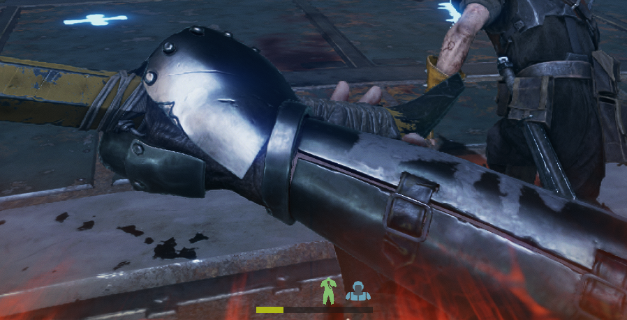

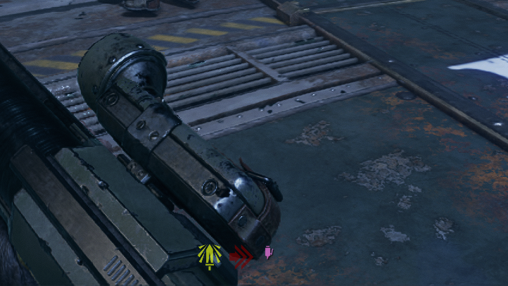

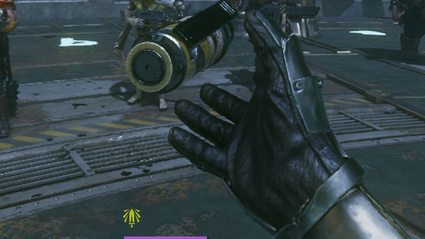

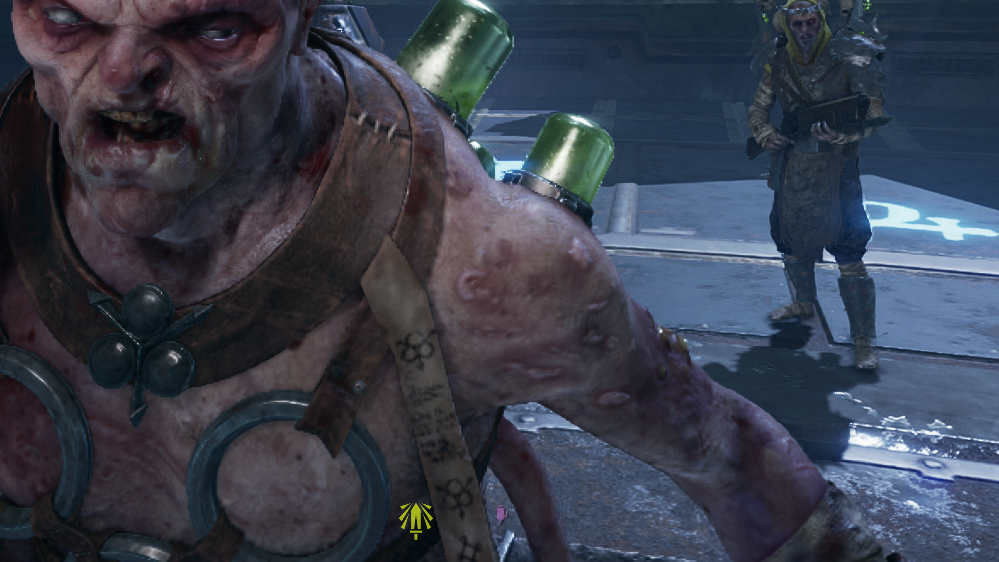

### Ammo
These appear on hotkey and inspecting the relevant weapon. All of these show value by color-coding.
- Special Ammo
    - Appears when holding the load special ammo button while the ranged weapon is out
- Magazine icons
    - Appears when holding reload while the ranged weapon is out
    - Color
        - [100%, 51%] is white
        - [50%, 26%] is orange
        - [25%, 0%] is red
        - 0% also makes the whole thing darken
    - Normally, you don't need to know magazine while reloading, but there are round reload weapons
- Total ammo icons
    - Same colors as above, but when at >= 85% ammo, the icon turns green to represent not needing to pick up a small ammo (does not change based on Havoc so you'll have to figure that one out yourself)
    - For general use, this is easier if it just appears while reloading, but most of the time I know roughly what my reserve is, and the feeling of holding reload to check feels cool
- Melee Special
    - No additional conditions

There are disabled options to show the raw numbers.

### Blitz Box (Below Max)
All will appear on holding hotkey T
- [ODO] Blitz Icon
    - I know what blitz I have equipped.
- Blitz count / max
    - Appears when 
        - Blitz is in hand and there is only one left (and the max count is > 1)
        - Blitz is in hand and inspecting
- Blitz recharge bar
    - Appears when charge > 70%
    - Disabled by default
    - Note that neither of them work with talent regeneration, where they'll get stuck at 100%
        - Namely this affects Demolition Stockpile, which is not good for me as a Veteran player
        - Disable this if it's annoying. I'm leaving this here for when there's a workaround found.
- Blitz recharge numerical
    - Same and also disabled

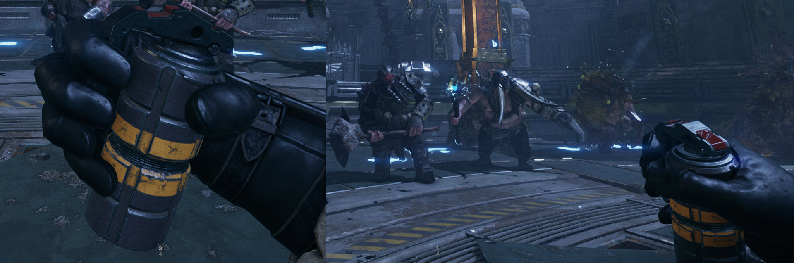

### Near Crosshair
Low opacity numbers for a quick glance while fighting. These don't have any hotkeys since I don't really want to see these outside of their respective context.
- Dodge count / max
    - Only appears when at <= 1
    - Turns red as you go more negative
- Dodge refresh bar
    - Only appears when at <= 1
    - I keep this off by default because I don't care
- Peril numerical value
    - Appears at >95%
    - Decimal point accuracy so you know if it's safe to use Brain Burst
    - :3
- Weapon heat
    - Appears when the respective weapon is held and heat is >= 90%
    - I put these in the same place for melee and ranged
    - One is orange and one is blue. I forgot which is which but you can also just look at the thing in your hand

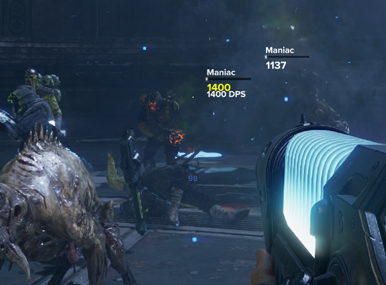

Peril from here and in the Player Panel bar:

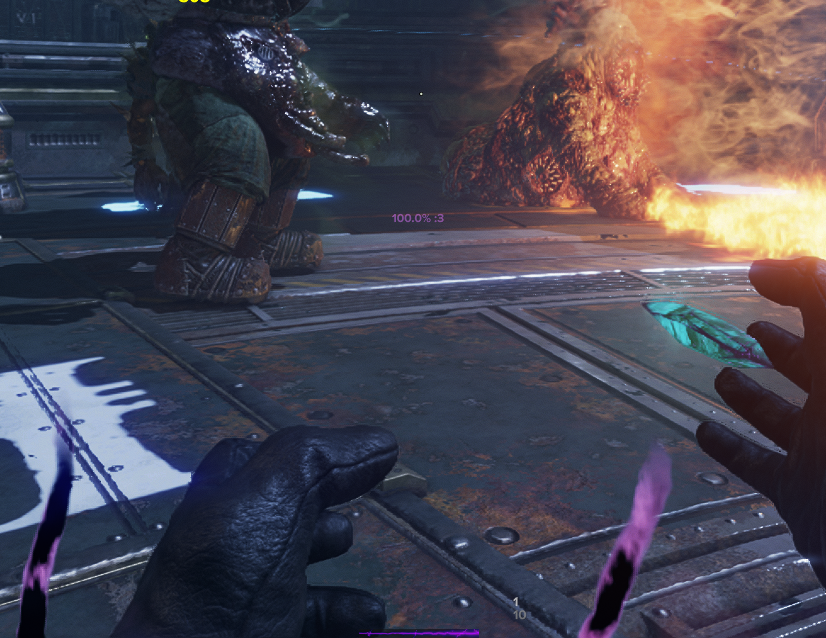

### Ally Panel Icons
Appears if alive and not a bot

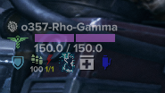

- Player Status Needs Help
    - Net, dog, etc.
    - Just a generic exclamation point icon. Disabled by default. I recommend using the blocks from [Player State Indicators](https://www.nexusmods.com/warhammer40kdarktide/mods/635) instead
- Player Identification
    - Class icon, character name, and True Level
        - Appears
            - OD
            - Player needs help
            - Same conditions as health
            - Toughness breaks
            - Player dies
        - At a glance, this makes it easier to know who the immediate danger applies to
        - Just the position besides text makes it hard to notice differences
        - I keep level since it's easier to remember "the level 500 Psyker and level 30 Psyker" as opposed to "Melisande Psyker and Dickot Psyker" 
    - [ODO] Account name
- Health Icon
    - Appears on change, needs help, or < 100 hp while corruption >= 50%
        - The health threshold is around when Poxbursters and Snipers lethal in normal matches
        - When downed, icon appears but at low opacity
    - Color-coded like the player panel
- Last Wound
    - Appears on top of the Health Icon when player is on their last wound
- [ODO] Health Details
    - Health bar with wound segments
    - Corruption overlay
    - Numerical current / max (1 decimal)
- [ODO] Toughness Details Icon
    - Blue at max, gold when above. Color fades out as it reduces.
    - Disappears when empty because...
- Toughness Broken Icon
    - Only appears at 0% toughness.
    - This is also a deep red, in contrast with the blue.
- Ammo Icon
    - Color-coded based on reserve ammo %
    - [ODO] Numerical %
- Blitz used
    - If has charges and just used (when < 2 charges), appear and linger
    - Uses a lightning bolt icon if it recharges, grenade icon otherwise.
    - Yellow normally, darker yellow when at 1, and dark red at 0
    - [ODO] Numerical count/max
- Ability Icon
    - Fades in when charging, appearing at 80%, and fully shows at 100% before fading out
    - If revealed on demand, you can see it at even lower opacities (eg < 50% is only 25% opaque)
    - By default this uses the actual icon, but there's a copy that uses the Strike icon, like in the Player Panel Icons bar
- Deployable (crate/ammo)
    - Appears and lingers when picking it up, getting disabled, going down, or dying
        - Disabled/down gives more info for who to help
        - Death is debatable but I like knowing if we just lost something
    - Appears and stays while team is low (see specifics in Player Panel)
- Stimm
    - Appears and lingers on pickup, getting disabled, going down, or dying
        - Disabled/down gives more info for who to help
        - Death is debatable but I like knowing if we just lost something
    - Appears and stays while team is low (see specifics in Player Panel)
    - Color-coded based currently held stimm
        - Uses colors from RecolorStimms if you have that installed
        - To use vanilla colors, duplicate the block --> go to this node --> Rectangle Style --> Color --> Change "Code" to "Data Source"

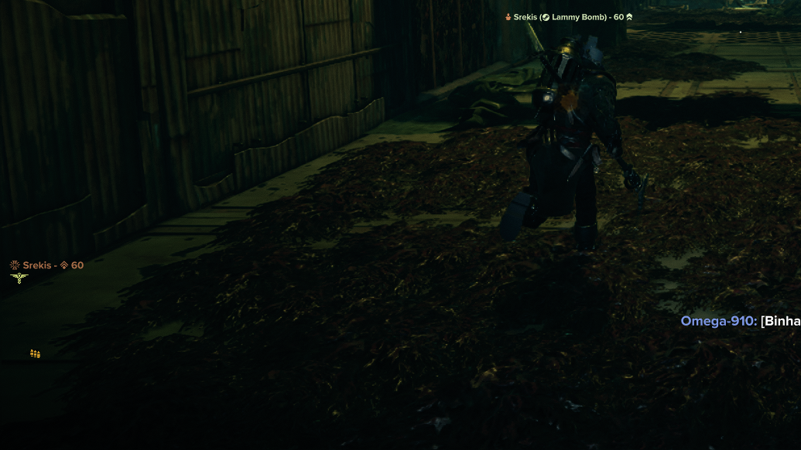

*Ally with low health.*

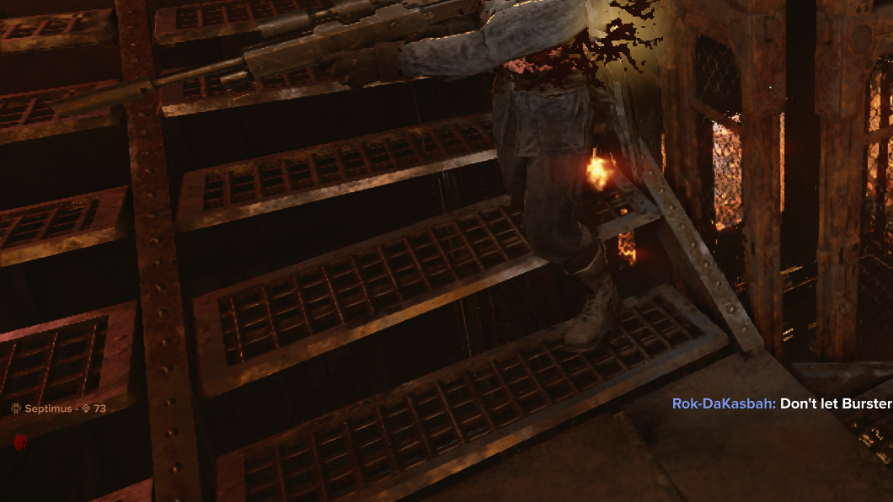

*Ally with broken toughness.*

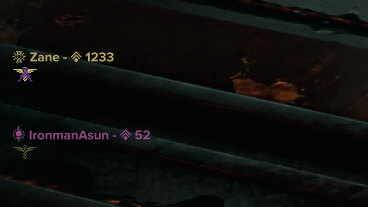

*Ally on their last wound, and ally downed.*

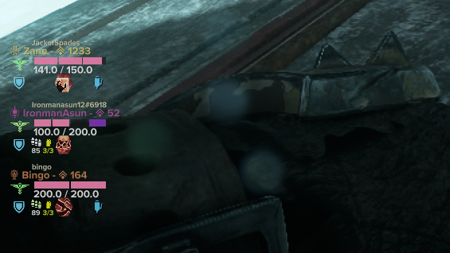

# Other Pictures
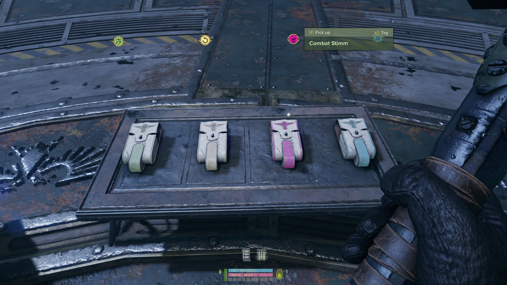