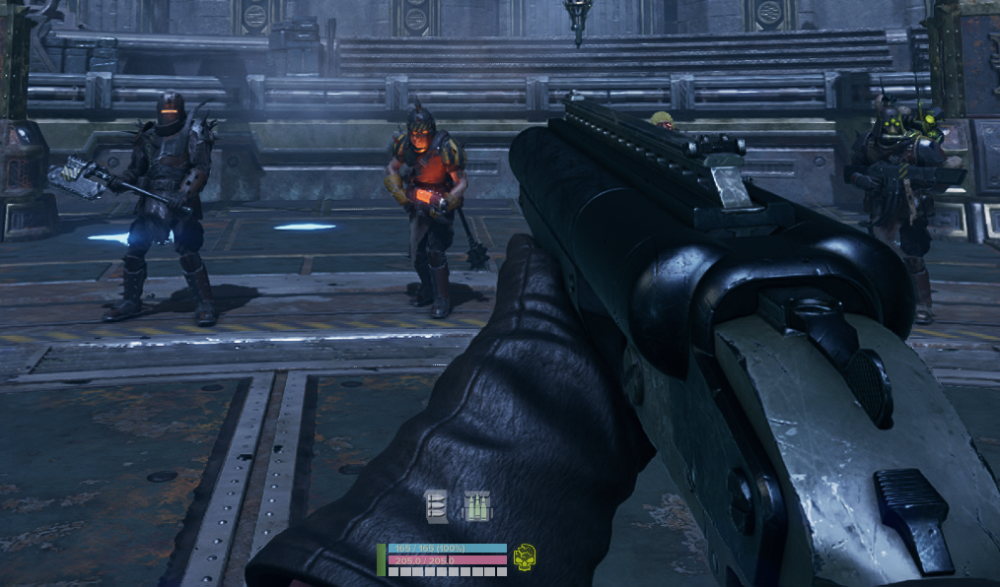

Add-on for [HUD Studio](https://www.nexusmods.com/warhammer40kdarktide/mods/1263).

# Description
Library of HUD Studio blocks with basic information hidden until needed (or demanded). Typically bars with numbers and color-coded icons.

Just installing this won't change anything; this is just a resource for you to use with HUD Studio.

# Installation
I assume you know how to install mods. If not, here's the [guide for manual installation](https://dmf-docs.darkti.de/#/installing-mods).
1. Install [HUD Studio](https://www.nexusmods.com/warhammer40kdarktide/mods/1263)
2. Install this mod (anywhere in the load order)
3. Open the game and load a character
4. Open the HUD Studio menu (set keybind in Mod Options)
5. Import blocks from this mod's library

Move and edit them to your heart's desire!

# Blocks
By default, all blocks will also appear on demand when you hold the hotkey `T`.

Elements marked [ODO] only appear when using the hotkey.

### Player Panel
- Toughness and Toughness text
    - Appears at < 30%
- Health and Health text
    - Appears when changed then fades
    - Appears at < 30%
- Stamina
    - Appears at < 30%
- Ability charge progress
    - Appears when you have no ability ready and the charge is at > 80% progress
- Peril
    - Bar that fades in with intensity
    - It goes from faded out pink to hot pink
    - Not in the pictures because it's fully transparent at 0%, but it's below the stamina bar

### Player Panel Icons and Progress
Alternative version of player panel with no text, focusing on cooldown availability. These can appear on demand, but note that some of them will still be hidden when the value is high enough (such as Stamina >= 50% still being hidden).

From left to right, top to bottom:
- Ability
    - Appears when >= 80% readiness
    - Starts at faded yellow (like a dark mustard), then becomes full yellow when a charge is ready
- Stamina
    - Fades in and becomes darker as you use it
    - Starts out not visible
    - < 50% is faded brown-orange
    - < 25% is brown-orange
    - < 15% is red
    - 0% is black
- Health
    - Appears when changed or < 30%
    - [75%, 100%] is bright green
    - [50%, 74%] is more yellow-green
    - [25%, 49%] is yellow
    - [15%, 24%] is orange-yellow
    - [0%, 14%] is red
    - Wounds are not shown and you are expected to just know that based on percentage
- Hives Cum Stimm
    - Overlayed with Health
    - Appears when >= 80% readiness
    - Starts at faded pink, then becomes full pink when ready
- Armor
    - Appears when < 30%
    - Overtoughness is yellow
    - [50%, 100%] is blue
    - [25%, 49%] is darker blue
    - [5%, 24%] is even darker blue
    - Below that is basically black
- Ability Progress Bar
    - Below the row of icons
    - Appears when ability is active
- Peril Progress Bar
    - Below ability progress
    - Same rules as previous panel (it's copied over)
- Hives Cum Stimm Progress Bar
    - In the same place as peril
    - Appears when Stimm is active and player is Hives Cum
    - I have it like that since it'd activate for other Stimms, so this would cover peril for Psykers
    - If you want both, remove the condition, then move this down, then move the block up so this one isn't offscreen (or peril)

### Ammo
These appear on hotkey and inspecting the relevant weapon. All of these show value by color-coding.
- Special Ammo
    - Same as above
    - Also appears when holding the load special ammo button while the ranged weapon is out
- Magazine icons
    - Changes color at 50% capacity and 100%
    - Also appears when holding reload while the ranged weapon is out
- Total ammo icons
    - Same as above
    - When at >= 85% ammo, the icon turns green to represent not needing to pick up a small ammo (does not change based on Havoc so you'll have to figure that one out yourself)
- Melee Special
    - No additional conditions

There are disabled options to show the raw numbers.

### Blitz Box (Below Max)
- [ODO] Blitz Icon
    - I know what blitz I have equipped.
- Blitz count / max
    - Appears when blitz is in hand and there is only one left
    - Appears when inspecting while blitz is in hand
    - Appears on hotkey T
- Blitz recharge bar
    - Appears when charge > 70%
    - Disabled by default
    - Note that neither of them work with talent regeneration, where they'll get stuck at 100%
        - Namely this affects Demolition Stockpile, which is not good for me as a Veteran player
        - Disable this if it's annoying. I'm leaving this here for when there's a workaround found.
- Blitz recharge numerical
    - Same and also disabled

### Near Crosshair
Low opacity numbers for a quick glance while fighting. These don't have any hotkeys since I don't really want to see these outside of their respective context.
- Dodge count / max
    - Only appears when at <= 1
    - Turns red as you go more negative
- Dodge refresh bar
    - Only appears when at <= 1
    - I keep this off by default because I don't care
- Peril numerical value
    - Appears at >95%
    - Decimal point accuracy so you know if it's safe to use Brain Burst
    - :3
- Weapon heat
    - Appears when the respective weapon is held and heat is >= 90%
    - I put these in the same place for melee and ranged
    - One is orange and one is blue. I forgot which is which but you can also just look at the thing in your hand

Peril from here and in the Player Panel bar:

### Ally Panel Icons [WIP]
Appears if alive and not a bot

!!! Right now, I think the logic can be tedious to change for blitz icon and stimm conditions. There's also a few things I'm iffy on, and I haven't used these in game. Consider this a prerelease block. I just realized I don't even have the disabled icon status yet lol.

- [ODO] Class icon and character name
    - [Planned] Also appear when any of the other icons appear
- Health Icon
    - Color-coded like the player panel
    - Appears on change
    - [Planned] Stay on low. <100 hp or something, whatever makes Poxbursters and Snipers lethal
    - [Planned] Appear on disabled/downed
- [ODO] Health Details
    - Health bar with wound segments
    - Corruption overlay
    - Numerical current / max
- [ODO] Toughness Details Icon
    - Blue at max, gold above (if I did it correctly). Fades out as it reduces.
    - Gone when empty because...
- Toughness Broken Icon
    - Only appears at 0% toughness
- Ammo Icon
    - Color-coded based on reserve ammo %
    - [ODO] Numerical %
- Blitz used
    - If has charges and just used (when < 2 charges), appear and linger
    - [ODO] Numerical count/max
    - [Planned] Streamline logic for material and conditions
- Ability Icon
    - Fades in when charging
    - Appears at 80%, and fully shows at 100% before fading out
    - If revealed on demand, you can see it at even lower opacities (eg < 50% is only 25% opaque)
- Pocketable (crate/ammo)
    - Appears and lingers when picking it up
    - [Planned] If medicrate, show if team health is low
    - [Planned] If ammo crate, show if team ammo is low
- Stimm (PROBABLY BEST TO DISABLE RIGHT NOW)
    - Appears and lingers on pickup
    - Color-coded based on what it is
    - [Planned] If med stimm, show if someone on the team is on the last wound
- [Planned] Player Status Needs Help
    - Net, dog, etc.
    - Countdown for rescue
    - I was thinking this would appear over the full thing

